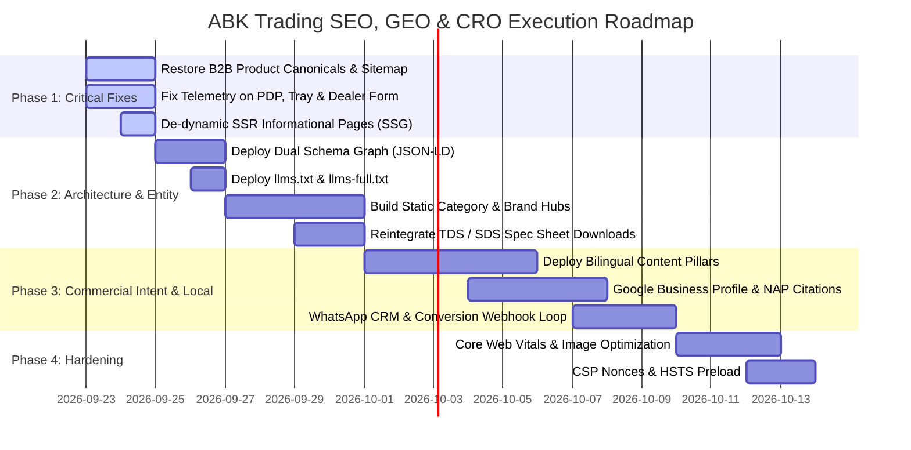

# ABK Trading & Service — Executive SEO, GEO & CRO Audit & Strategic Roadmap

**Target Entity:** ABK Trading & Service (ABK Trading and Service — Vertek & Autotriz)  
**Live Production URL:** `https://abktradingservice.com/`  
**Audited Codebase:** Next.js 16.2.4 (Turbopack, App Router), React 19.2.4, Tailwind CSS 4, next-intl bilingual (EN/AR), TypeScript  
**Core Markets:** State of Qatar (Doha, Mesaimeer, Al Rayyan, Industrial Area, Lusail, Al Wakrah) & GCC (Saudi Arabia, UAE, Kuwait, Bahrain, Oman)  
**Business Model:** Dual B2C (Direct Consumer Retail Car Care) & B2B (Wholesale Supply, Detailing Studio & Tint Shop Trade Distribution)  
**Audit Date:** September 2026  
**Audited By:** Principal Technical SEO, GEO Architect, CRO Lead & Next.js Systems Architect  

---

## 1. Executive Synthesis & Strategic State

ABK Trading & Service possesses a modern, meticulously crafted technical base. Built on Next.js 16, Tailwind CSS 4, and next-intl, the frontend mimics the minimalist, premium aesthetic of the Apple Store with bespoke dark glass navigation, custom product tiles, bilingual English/Arabic parity, and deep WhatsApp integration tailored to the Gulf automotive culture.

However, a rigorous investigation of the active source code, build output, and search/analytics telemetry reveals **structural friction points and architectural compromises** that severely hinder commercial organic search visibility, Generative Engine Optimization (GEO) citations across AI models, and analytics-driven conversion optimization.

### Key Strategic Findings at a Glance

```
┌────────────────────────────────────────────────────────────────────────────────────────────────┐
│                                   ABK TRADING AUDIT OVERVIEW                                   │
├───────────────────────────────┬───────────────────────────────┬────────────────────────────────┤
│ Area                          │ Health / Rating               │ Primary Constraint             │
├───────────────────────────────┼───────────────────────────────┼────────────────────────────────┤
│ 1. Technical SEO & Architecture│ ⚠️ 72/100 (Compromised)       │ 53 B2B products de-indexed;     │
│                               │                               │ core pages SSR-dynamic.        │
├───────────────────────────────┼───────────────────────────────┼────────────────────────────────┤
│ 2. Bilingual & RTL Execution   │ 🟢 94/100 (Excellent)         │ High copy parity (398 keys);   │
│                               │                               │ minor typography letter-spacing│
├───────────────────────────────┼───────────────────────────────┼────────────────────────────────┤
│ 3. B2B vs. B2C CRO & Funnels  │ ⚠️ 65/100 (High Friction)     │ Missing telemetry on PDP CTAs; │
│                               │                               │ dormant TDS/spec sheet assets. │
├───────────────────────────────┼───────────────────────────────┼────────────────────────────────┤
│ 4. GEO & Entity Graph         │ ⚠️ 68/100 (Incomplete)        │ Missing WholesaleStore entity; │
│                               │                               │ no llms-full.txt deep manifest │
├───────────────────────────────┼───────────────────────────────┼────────────────────────────────┤
│ 5. Commercial Intent & Local  │ 🟡 75/100 (Unrealized)        │ No static category hub pages;  │
│    Footprint                  │                               │ GBP category misalignment.     │
└───────────────────────────────┴───────────────────────────────┴────────────────────────────────┘
```

---

## 2. Critical Flaws & Root Cause Analysis

### 1. The B2B Self-Canonicalization Trap (P0 Blocker)
In `src/app/[locale]/b2b/products/[slug]/page.tsx` (lines 55–61), the system forces any product with `audience: "both"` to set its canonical tag to `/b2c/products/${product.slug}`. Because **53 out of 54 products** in `src/data/products.ts` have `audience: "both"`, 53 B2B product pages actively command search engines: *"Do not index this page; index the retail B2C version instead."* Furthermore, `src/app/sitemap.ts` strips out all B2B URLs for shared products.  
* **Commercial Consequence:** Detailing studios, body shops, and commercial carwashes in Qatar searching for "wholesale PPF rolls", "Autotriz ceramic trade supplier", or "شامبو سيارات 20 لتر بالجملة" never encounter a wholesale landing page. When they land on the B2C page, they see retail bottle prices and DIY instructions rather than wholesale tiers, master carton specs, and trade quote options.

### 2. Analytics Blind Spots & Telemetry Leakage (P0 Blocker)
The primary WhatsApp ordering CTA in `src/components/product/ProductPurchasePanel.tsx` (lines 245–263) and the WhatsApp Order Tray dispatch in `src/components/cart/OrderTray.tsx` (line 298) **lack Plausible tracking classes (`plausible-event-name`) and Google Ads/GA4 audience attributes**. Furthermore, the dealer onboarding form in `src/components/dealer/DealerApplicationForm.tsx` triggers WhatsApp via `window.open()` upon form submission—completely bypassing the click-listener in `src/instrumentation-client.ts`.  
* **Commercial Consequence:** Real high-intent inquiries from the most critical purchase surfaces are completely dark to Google Ads Smart Bidding ("Maximize Conversions") and Plausible dashboards. Campaigns in `marketing/google-ads/` will bid blindly without conversion signals.

### 3. Server-Side Rendering De-Optimization on Static Informational Pages (P0 Blocker)
In `src/app/[locale]/about/page.tsx`, `contact/page.tsx`, `privacy/page.tsx`, and `terms/page.tsx`, calling `await cookies()` to read the `abk_audience` cookie forces Next.js App Router to designate these routes as **Dynamic SSR (`ƒ server-rendered on demand`)** during `next build`.  
* **Commercial Consequence:** Core crawl targets (About with its 12-item FAQ schema, Contact with its NAP and LocalBusiness schema) lose edge caching benefits, increasing Time to First Byte (TTFB) and Googlebot crawl latency without delivering any dynamic personalization value.

### 4. Absence of Static Category & Brand Indexation Hubs (P1 High ROI)
Product filtering on `/b2c/products` and `/b2b/products` operates entirely via client-side search parameters (`?brand=VTEK&category=ppf`). All filtered views canonicalize back to the root catalogue.  
* **Commercial Consequence:** There are no dedicated indexable URLs for high-volume searches such as "Paint Protection Film Qatar", "Ceramic Coating Doha", "Car Shampoo Wholesale", or "VTEK Qatar". Google cannot match mid-funnel category search intent to dedicated landing pages.

### 5. Dormant Commercial Assets: Severed TDS & Specification Sheets (P1 High ROI)
Commit `1599418` removed catalogue downloads from product detail pages, rendering `catalogue_download` conversion tracking dormant. Detailing studios and commercial installers heavily rely on Technical Data Sheets (TDS), Safety Data Sheets (SDS), and warranty specifications before committing to bulk purchases.

---

## 3. Prioritized Action Matrix

The recommendations are structured into four clear tiers of operational priority:

| Priority | Focus Area | Action Item | Primary Impact | Est. Effort |
|---|---|---|---|---|
| **P0** | **Technical / Indexation** | Differentiate B2B product pages and restore self-referencing canonicals + sitemap entries. | Restores 106 de-indexed B2B URLs in EN & AR for wholesale search queries. | 4 hours |
| **P0** | **Telemetry / CRO** | Instrument `ProductPurchasePanel`, `OrderTray`, and `DealerApplicationForm` with GA4/Plausible events. | Enables Google Ads Smart Bidding and captures 100% of conversion volume. | 2 hours |
| **P0** | **Performance / SSG** | Decouple `await cookies()` from `about`, `contact`, `privacy`, and `terms` pages to restore static generation. | Reduces TTFB by 150–300ms; achieves 100% static edge delivery. | 1.5 hours |
| **P1** | **IA & Organic Search** | Build dedicated static category and brand landing pages (`/[locale]/[audience]/categories/[slug]`). | Captures high-volume non-branded Qatar search traffic ("PPF Qatar", "Ceramic Coating Doha"). | 6 hours |
| **P1** | **GEO / Structured Data** | Deploy dual `AutoPartsStore` + `WholesaleStore` schema graph and publish `public/llms-full.txt`. | Maximizes entity grounding in ChatGPT, Perplexity, Claude, and Gemini. | 3 hours |
| **P1** | **B2B Funnel / CRO** | Reactivate Technical Data Sheets (TDS) and commercial pack specs on B2B product views. | Increases B2B conversion rate and qualified wholesale RFQ inquiries. | 3 hours |
| **P2** | **Content Depth** | Author 4 commercial pillar guides targeting Qatar detailing challenges (Extreme heat, sand, hard water). | Establishes top-of-funnel organic search dominance and AI citation authority. | 8 hours |
| **P2** | **Local SEO / GBP** | Align GBP primary category to "Auto parts store" / "Wholesale store" and launch GCC citation push. | Boosts Google Maps Local 3-Pack rankings in Doha and Mesaimeer. | 4 hours |
| **P3** | **Security / CWV** | Implement nonce-based CSP, fine-tune `next/image` sizes attributes, and submit domain to HSTS Preload. | Long-term operational hardening and perfect Core Web Vitals. | 4 hours |

---

## 4. Implementation Roadmap & Phased Milestones



### Immediate Next Steps (First 48 Hours)
1. **Commit Code Fix for B2B Canonicals:** Edit `src/app/[locale]/b2b/products/[slug]/page.tsx` and `src/app/sitemap.ts` to make B2B product routes self-canonical and include them in XML sitemaps.
2. **Commit Telemetry Patch:** Add Plausible classes and data attributes to `ProductPurchasePanel.tsx`, `OrderTray.tsx`, and wire a tracking callback into `DealerApplicationForm.tsx`.
3. **Commit Static Optimization:** Remove `await cookies()` from `about/page.tsx`, `contact/page.tsx`, `terms/page.tsx`, and `privacy/page.tsx`, passing a default audience and hydrating client-side.
4. **Deploy `public/llms-full.txt`:** Provide deep, structured product, brand, and commercial data for AI retrieval agents.

---

*Continue to [02_TECHNICAL_SEO_AND_CODE_AUDIT.md](./02_TECHNICAL_SEO_AND_CODE_AUDIT.md) for code-level diffs and technical implementations.*
