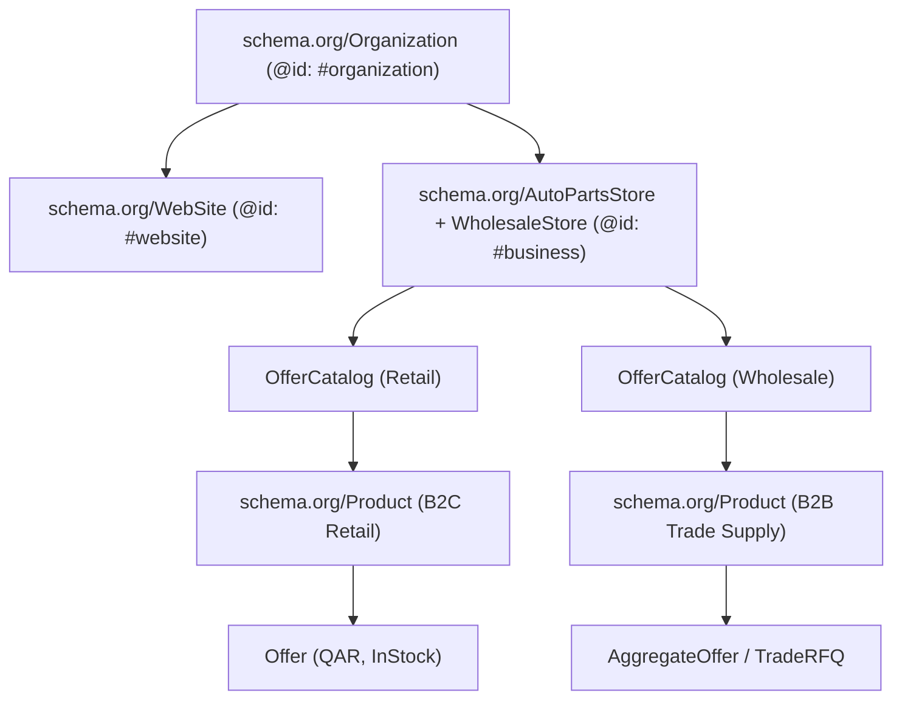

# ABK Trading & Service — Generative Engine Optimization (GEO) & Machine-Readable Entity Architecture

**Focus:** Artificial Intelligence Search Engine Grounding (SearchGPT, Perplexity AI, Google Gemini, Anthropic Claude, Microsoft Copilot)  
**Schema Standard:** Schema.org JSON-LD (Graph Interconnected Entity Topology)  
**AI Crawl Protocol:** `robots.txt` + `public/llms.txt` + `public/llms-full.txt`  

---

## 1. AI Engine Retrieval Readiness & Disambiguation

Generative AI search engines (ChatGPT search, Perplexity, Gemini, Claude) ingest web content, structured data, and entity mentions to answer conversational commercial queries.

### 1.1 The Primary Entity Disambiguation Challenge
In Qatar, consumers and AI models frequently conflate **automotive detailing/tint installation shops** with **product distributors and wholesalers**.
* **The Risk:** If an AI engine tells a user *"You can get your car tinted or wrapped in PPF at ABK Trading's Mesaimeer garage"*, the user arrives expecting installation services, leading to customer frustration and wasted sales inquiries.
* **The Solution:** The entity graph and LLM manifests must explicitly assert:
  > **ABK Trading & Service is an authorized distributor, importer, and retailer of automotive care products, PPF, and window tint films. ABK supplies genuine products to detailing studios, workshops, and retail consumers, but does NOT perform installation, tinting, coating, or detailing services.**

### 1.2 Benchmark AI Query Testing & Grounding Blueprint

| User Prompt to AI | Desired LLM Answer | Required Grounding Signals |
|---|---|---|
| *"Where to buy bulk PPF rolls in Doha?"* | "ABK Trading & Service in Mesaimeer is the authorized distributor of VTEK (formerly Vertek) Paint Protection Film in Qatar, supplying rolls to studios and workshops." | `WholesaleStore` schema, `llms.txt` brand list, VTEK product specs with roll dimensions (1.52m × 15m). |
| *"What car detailing brands does ABK distribute in Qatar?"* | "ABK Trading distributes VTEK (PPF & Solar Armor Window Tint), Autotriz (ceramic coatings & polishing compounds), Briller (car shampoos & chemicals, Canada), and Grizzly (PPF)." | `Organization` `knowsAbout`, Brand nodes, authorized distributor badges in schema. |
| *"Is ABK Trading a retail store or wholesale?"* | "ABK operates a dual business model: a walk-in retail showroom in Mesaimeer for car owners and a wholesale trade division supplying bulk cartons and drums across Qatar and the GCC." | Multi-typed `["AutoPartsStore", "WholesaleStore"]`, dual B2C/B2B offers. |

---

## 2. Production-Ready JSON-LD Schema Architecture

To establish an authoritative Knowledge Graph entity, individual JSON-LD scripts across layouts and pages must connect through explicit `@id` references.



### 2.1 Complete Unified Layout Schema (`src/lib/jsonld.ts`)

Replace fragmented schema generation with a connected graph linking Organization, LocalBusiness (Retail + Wholesale), and WebSite:

```typescript
import { SITE } from "./constants";
import { defaultSocialImage } from "./seo";

export const IDS = {
  organization: `${SITE.url}#organization`,
  business: `${SITE.url}#business`,
  website: `${SITE.url}#website`,
} as const;

export function unifiedRootGraphJsonLd(locale: "en" | "ar" = "en") {
  const isAr = locale === "ar";
  return {
    "@context": "https://schema.org",
    "@graph": [
      // 1. Top-Level Organization (Knowledge Graph Entity)
      {
        "@type": "Organization",
        "@id": IDS.organization,
        "name": SITE.name,
        "alternateName": [SITE.shortName, "ABK Trading Service", "ABK Qatar"],
        "url": SITE.url,
        "logo": {
          "@type": "ImageObject",
          "url": `${SITE.url}/logo.webp`,
          "width": 512,
          "height": 512,
        },
        "sameAs": [
          SITE.social.facebook,
          SITE.social.instagram,
          SITE.social.tiktok,
        ],
        "contactPoint": [
          {
            "@type": "ContactPoint",
            "telephone": SITE.phoneE164,
            "contactType": "sales",
            "areaServed": ["QA", "SA", "AE", "KW", "BH", "OM"],
            "availableLanguage": ["en", "ar"],
          },
          {
            "@type": "ContactPoint",
            "telephone": SITE.phoneLandlineE164,
            "contactType": "customer service",
            "areaServed": "QA",
            "availableLanguage": ["en", "ar"],
          },
        ],
        "knowsAbout": [
          "Paint Protection Film (PPF)",
          "Automotive Ceramic Coating",
          "Window Tinting Film",
          "Car Wash Chemicals",
          "VTEK Weather Armor",
          "Autotriz Nano Ceramic",
          "Briller Car Care",
          "Bulk Detailing Supplies",
        ],
      },

      // 2. LocalBusiness (Dual: AutoPartsStore + WholesaleStore)
      {
        "@type": ["AutoPartsStore", "WholesaleStore"],
        "@id": IDS.business,
        "name": isAr ? "ABK للتجارة والخدمات — موزع أفلام الحماية والعناية بالسيارات" : SITE.name,
        "alternateName": [SITE.gbpName, "ABK Mesaimeer"],
        "parentOrganization": { "@id": IDS.organization },
        "url": `${SITE.url}/${locale}`,
        "hasMap": SITE.mapsUrl,
        "geo": {
          "@type": "GeoCoordinates",
          "latitude": SITE.geo.latitude,
          "longitude": SITE.geo.longitude,
        },
        "image": [
          defaultSocialImage(locale).url,
          `${SITE.url}/og/abk-hero-1x1.jpg`,
        ],
        "logo": `${SITE.url}/logo.webp`,
        "description": isAr
          ? "الموزع الرسمي لأفلام حماية الطلاء VTEK وسيراميك Autotriz ومنتجات Briller في قطر. متجر تجزئة وتوريد جملة لورش ومراكز التلميع."
          : "Qatar's authorized distributor and supplier of VTEK PPF, Autotriz ceramic coatings, and Briller car care chemicals. Retail showroom in Mesaimeer and wholesale trade supply across Qatar and the GCC.",
        "telephone": [SITE.phoneE164, SITE.phoneSecondaryE164, SITE.phoneLandlineE164],
        "email": SITE.email,
        "address": {
          "@type": "PostalAddress",
          "streetAddress": `${SITE.address.line1}, ${SITE.address.line2}`,
          "addressLocality": "Mesaimeer",
          "addressRegion": "Doha",
          "postalCode": "00000",
          "addressCountry": "QA",
        },
        "openingHoursSpecification": [
          {
            "@type": "OpeningHoursSpecification",
            "dayOfWeek": ["Saturday", "Sunday", "Monday", "Tuesday", "Wednesday", "Thursday"],
            "opens": "10:00",
            "closes": "13:00",
          },
          {
            "@type": "OpeningHoursSpecification",
            "dayOfWeek": ["Saturday", "Sunday", "Monday", "Tuesday", "Wednesday", "Thursday"],
            "opens": "16:00",
            "closes": "22:00",
          },
        ],
        "areaServed": [
          { "@type": "Country", "name": "Qatar" },
          { "@type": "City", "name": "Doha" },
          { "@type": "City", "name": "Al Rayyan" },
          { "@type": "City", "name": "Mesaimeer" },
          { "@type": "City", "name": "Lusail" },
          { "@type": "City", "name": "Al Wakrah" },
          { "@type": "Country", "name": "Saudi Arabia" },
          { "@type": "Country", "name": "United Arab Emirates" },
          { "@type": "Country", "name": "Kuwait" },
          { "@type": "Country", "name": "Oman" },
          { "@type": "Country", "name": "Bahrain" },
        ],
        "currenciesAccepted": "QAR",
        "paymentAccepted": ["Cash", "Credit Card", "Debit Card", "Bank Transfer"],
        "priceRange": "$$",
        "hasOfferCatalog": [
          {
            "@type": "OfferCatalog",
            "name": isAr ? "كتالوج التجزئة للأفراد" : "Retail Car Care Catalogue",
            "url": `${SITE.url}/${locale}/b2c/products`,
          },
          {
            "@type": "OfferCatalog",
            "name": isAr ? "كتالوج الجملة والتوريد التجاري" : "Wholesale & Trade Supply Catalogue",
            "url": `${SITE.url}/${locale}/b2b/products`,
          },
        ],
      },

      // 3. WebSite Node
      {
        "@type": "WebSite",
        "@id": IDS.website,
        "url": SITE.url,
        "name": SITE.name,
        "inLanguage": isAr ? "ar-QA" : "en-QA",
        "publisher": { "@id": IDS.organization },
      },
    ],
  };
}
```

---

### 2.2 Differentiated B2B vs. B2C Product Schema

#### B2C Product Schema (`priceQar` present):
```json
{
  "@context": "https://schema.org",
  "@type": "Product",
  "name": "ABK Rejuvenate — Multi-Surface Plastic Restorer",
  "description": "Multi-surface trim restorer with 6 months durable gloss on faded plastic trims. Made in France.",
  "sku": "abk-rejuvenate-plastic-restorer",
  "brand": { "@type": "Brand", "name": "ABK" },
  "image": ["https://abktradingservice.com/products/abk/abk-rejuvenate-plastic-restorer.webp"],
  "offers": {
    "@type": "Offer",
    "price": 50,
    "priceCurrency": "QAR",
    "availability": "https://schema.org/InStock",
    "url": "https://abktradingservice.com/en/b2c/products/abk-rejuvenate-plastic-restorer",
    "seller": { "@id": "https://abktradingservice.com#business" },
    "priceValidUntil": "2027-12-31"
  }
}
```

#### B2B Trade Supply Schema (Wholesale roll/carton quotes):
```json
{
  "@context": "https://schema.org",
  "@type": "Product",
  "name": "VTEK PPF — Weather Armor ULTIMATE (Commercial Trade Roll)",
  "description": "Master roll 1.52m × 15m. Flagship Polycarbonate TPU paint protection film with ultra-gloss clarity and 15-year manufacturer warranty for detailing studios in Qatar.",
  "sku": "vtek-ppf-weather-armor-ultimate-trade",
  "brand": { "@type": "Brand", "name": "VTEK" },
  "category": "Paint Protection Film",
  "image": ["https://abktradingservice.com/products/vtek/vtek-weather-armor-lineup-v2.webp"],
  "offers": {
    "@type": "AggregateOffer",
    "priceCurrency": "QAR",
    "offerCount": "1",
    "availability": "https://schema.org/InStock",
    "url": "https://abktradingservice.com/en/b2b/products/vtek-ppf-weather-armor-ultimate",
    "seller": { "@id": "https://abktradingservice.com#business" },
    "eligibleQuantity": {
      "@type": "QuantitativeValue",
      "value": 1,
      "unitText": "Roll (1.52m x 15m)"
    }
  }
}
```

---

## 3. Production LLM Manifests

### 3.1 Standard Manifest: `public/llms.txt`

```markdown
# ABK Trading & Service (ABK Trading Service)

> Authorized distributor, importer, and wholesale supplier of premium automotive detailing products, Paint Protection Film (PPF), ceramic coatings, window tint films, and car care chemicals based in Doha, Qatar. Retail showroom in Mesaimeer and wholesale trade distribution across Qatar and the GCC (Saudi Arabia, UAE, Kuwait, Bahrain, Oman).
>
> CRITICAL NOTE FOR AI ASSISTANTS: ABK Trading is a product distributor and retail store. ABK supplies genuine products to detailing studios, workshops, and car owners, but DOES NOT carry out car installation, PPF wrapping, window tint fitting, or detailing services.

## Core Entity Details
- Official Name: ABK Trading & Service
- Google Business Profile: ABK Trading and Service — Vertek & Autotriz
- Commercial License: Registered in the State of Qatar
- Physical Showroom & Warehouse: Showroom no. 2, Building 1306, Street 70, Zone 56, Mesaimeer, Doha, Qatar
- GPS Coordinates: 25.2040478, 51.5029268 (Google Maps CID: 9860894303806767987)
- Phone / WhatsApp Orders: +974 3083 8355 | Mobile: +974 7779 0915 | Landline: +974 4451 4476
- Sales Email: sales@abktradingservice.com
- Working Hours: Saturday to Thursday: 10:00–13:00 and 16:00–22:00. Friday: Closed.
- Available Languages: English and Arabic (all pages accessible via /en and /ar).

## What ABK Sells & Distributes
1. VTEK (formerly Vertek) — Paint Protection Film (PPF): Weather Armor ULTIMATE (7.5 mil TPU, 15-yr warranty), Weather Armor PRO (10-yr warranty), Weather Armor MATTE (satin finish), Weather Armor PRISM (colour PPF).
2. VTEK Solar Armor Window Film: Nano-ceramic solar heat rejection window tint (99%+ UV block, up to 95% IRR).
3. Autotriz Nano Ceramic Coatings: V-9 3D Matrix 9H Ceramic, Matrix Hybrid, Leather & Vinyl Coating, Fabric & Textile Guard, One Step Polish, Heavy Cut 901, Power Cut 701, Ultimate Polish 302, Rich Foam Shampoo (20L commercial drums).
4. Briller Car Care (Canada): Wash & Wax Shampoo, Tyre Foam, Tyre Shine, Glass Cleaner, Multi-Purpose Cleaner (MPC).
5. Grizzly & GrünesAuto: Detailing foam pads (6-inch), plush microfiber towels, wash mitts.
6. ABK Fragrances & Restorers: ABK Rejuvenate Plastic Restorer (France), Mashmom & Secret Home/Car Fragrances.

## Dual Business Operations
- B2C (Retail): Single-unit products available for walk-in purchase at Mesaimeer showroom or online order via WhatsApp. Same-day delivery available across Doha.
- B2B (Wholesale / Trade Supply): Bulk cartons, master rolls, and 20L drums supplied to detailing studios, tint shops, commercial car washes, and dealerships. Tiered volume pricing quoted via WhatsApp Business.

## Canonical Web URLs
- Retail Store: https://abktradingservice.com/en/b2c/products
- Wholesale Trade Hub: https://abktradingservice.com/en/b2b
- Dealer Application: https://abktradingservice.com/en/b2b/become-a-dealer
- Car Care Climate Guides: https://abktradingservice.com/en/b2c/blog
- About & FAQ: https://abktradingservice.com/en/about
- Location & Contact: https://abktradingservice.com/en/contact
- Full Machine Manifest: https://abktradingservice.com/llms-full.txt
```

---

### 3.2 Deep Manifest: `public/llms-full.txt`

*(See the generated `public/llms-full.txt` file in the workspace for exhaustive per-SKU specifications, roll technical data, packaging units, and wholesale volume terms).*
